# 🧠 Image Processing Projects

A collection of Python-based projects exploring the **mathematical and algorithmic foundations** of image processing and computer vision.  
Each assignment implements core techniques *from scratch* using **NumPy**, **OpenCV**, and **Matplotlib** — emphasizing **understanding the math behind the algorithms** rather than relying on built-in functions.

---

## 📚 Overview

This repository includes several assignments demonstrating different aspects of digital image analysis:

| Assignment | Topic | Main Concepts |
|-------------|--------|----------------|
| [Assignment 1 – Pyramids Everywhere](./assignment1/README.md) | Intro to Python, NumPy, and OpenCV basics | String manipulation, array operations, image masking and overlay |
| [Assignment 2 – Morphological Operations & Connected Components](./assignment2/README.md) | Implementing dilation and erosion manually; detecting words in an image | Morphological filters, binary masks, connected components |
| [Assignment 3 – Bilateral Filtering & Edge Detection](./assignment3/README.md) | Building a bilateral filter from scratch and comparing to OpenCV | Non-linear filtering, noise reduction, **Canny edge detection** |
| [Assignment 4 – Vignetting Correction via Regression](./assignment4/README.md) | Correcting brightness falloff (vignetting) using a mathematical model | Polynomial modeling, **Least Squares Regression**, camera calibration |
| [Assignment 5 – Circle Hough Transform](./assignment5/README.md) | Manual & automated detection of circular shapes | 3D Hough space, accumulator voting, Canny edges, `cv2.HoughCircles`, circle classification |

📌 *More projects will be added soon.*

---

## 🧮 Topics Covered
- Image representation and pixel-level operations  
- Convolution and kernel-based filtering  
- Morphological operators (dilate, erode)  
- Binary thresholding and connected components  
- Bilateral filtering and noise reduction  
- **Edge detection** using Canny operator  
- Regression-based image correction (vignetting)  
- **Circle detection via Hough Transform (manual & OpenCV)**  
- Visualization and debugging with Matplotlib  

---

## 🧰 Technologies Used
- Python 3  
- NumPy  
- OpenCV  
- Matplotlib  
- Jupyter Notebook  

---

## 🎯 Learning Objectives
These projects aim to:
- Understand the **mathematics, geometry, and regression models** behind image processing  
- Implement algorithms manually before using OpenCV’s built-in methods  
- Strengthen algorithmic thinking and visualization skills  
- Explore how computer vision systems process and enhance real-world images  
- Build intuition for accumulator-based voting algorithms  

---

## 📸 Example Results

| Task | Input | Output |
|:-----|:--------|:-------|
| **Morphological Dilation** | 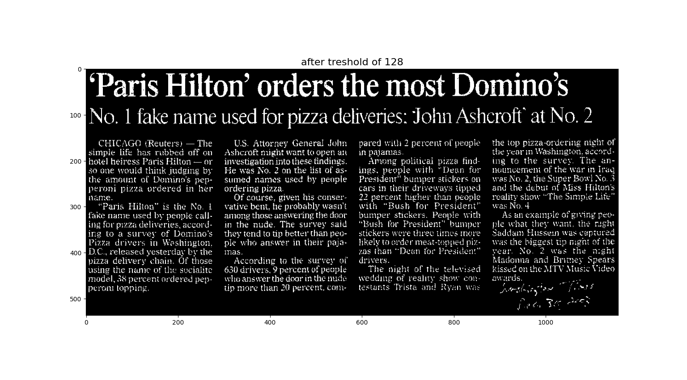 | .png) |
| **Word Detection (Connected Components)** | 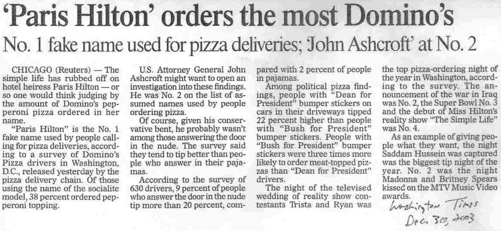 | 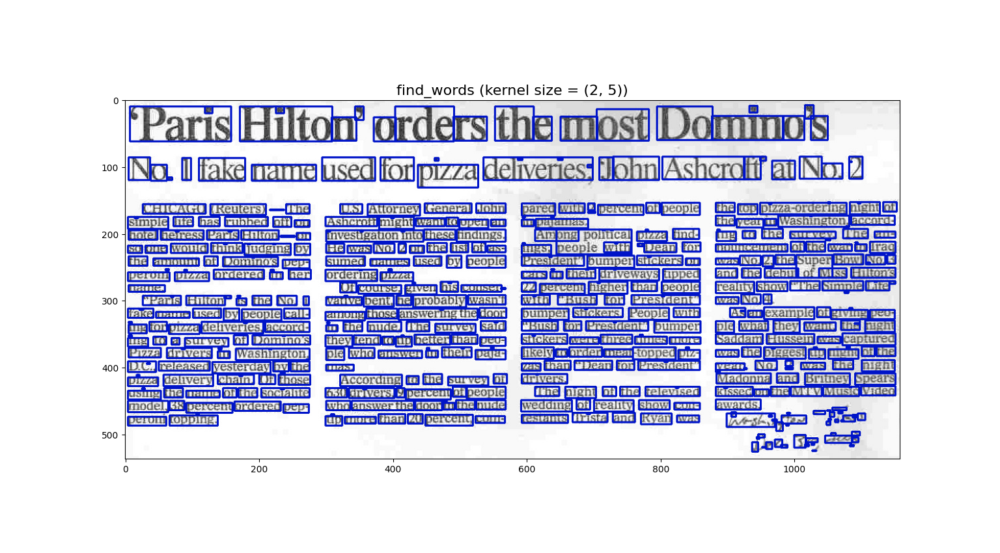 |
| **Bilateral Filtering** | 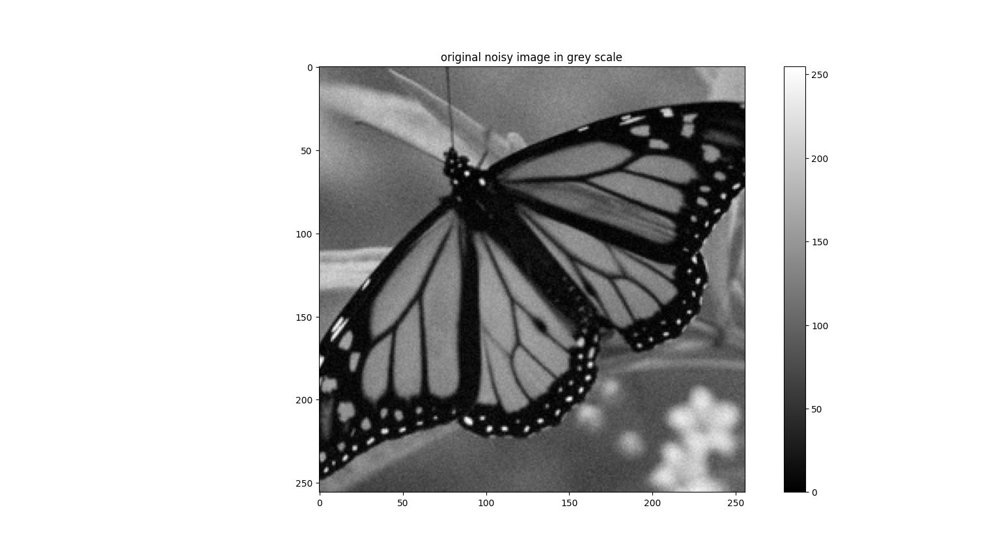 | 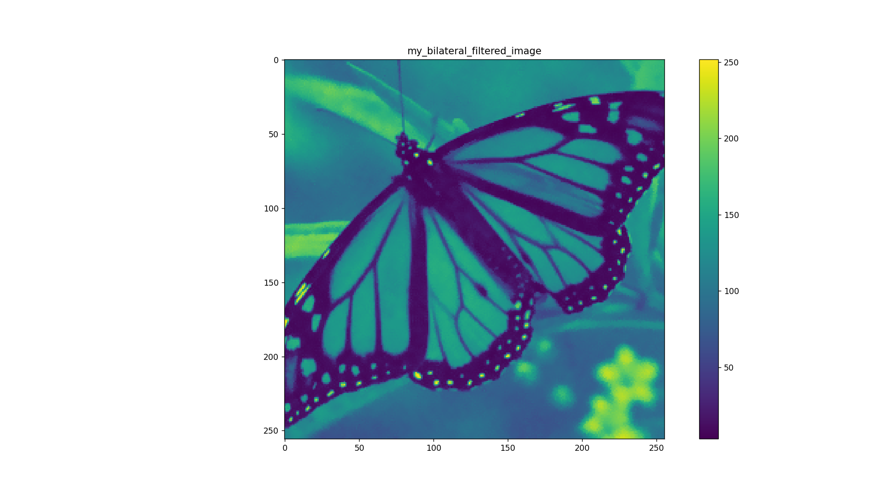 |
| **Edge Detection (Canny)** |  | 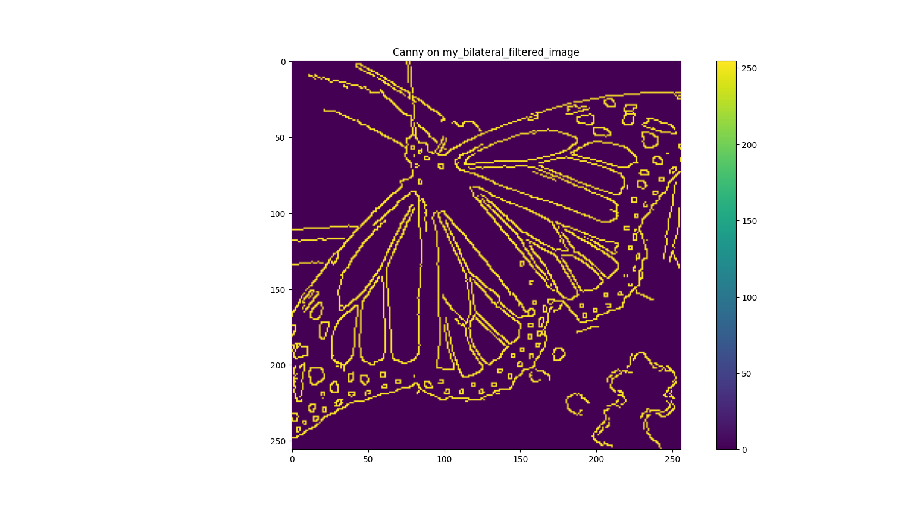 |
| **Vignetting Correction** | 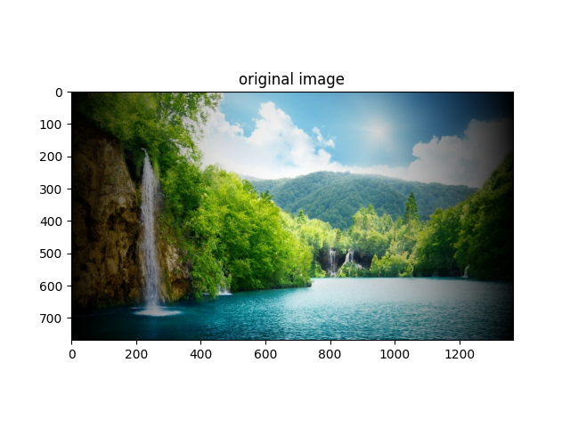 | 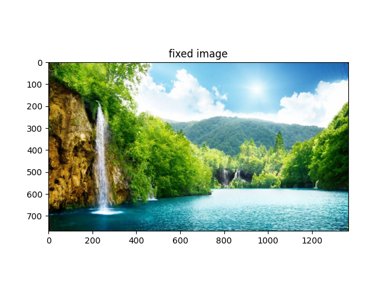 |
| **Manual Circle Detection (Hough Transform)** | 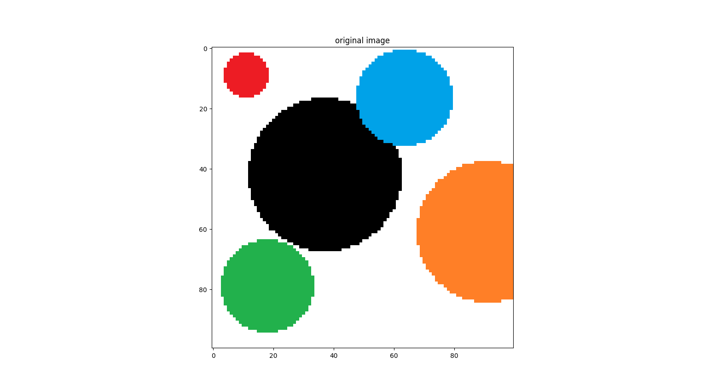 | 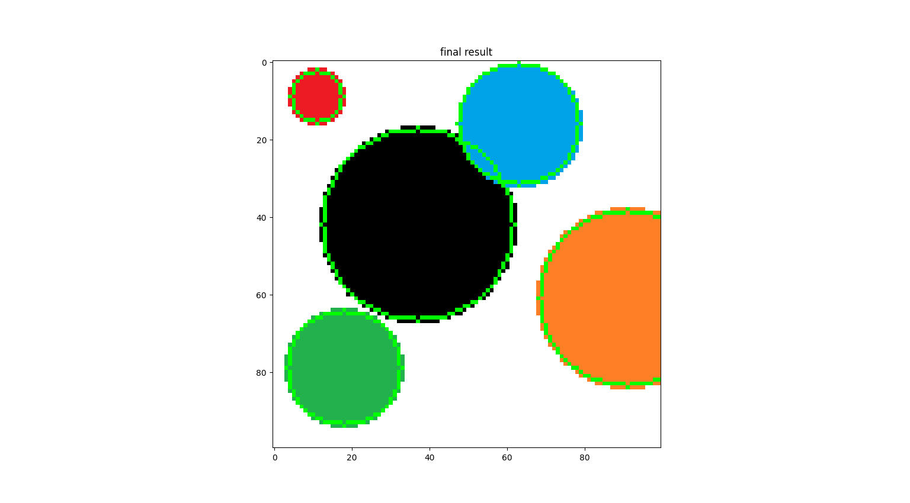 |
| **Coin Detection (HoughCircles)** | 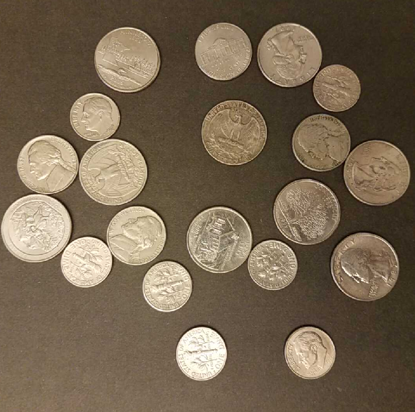 | 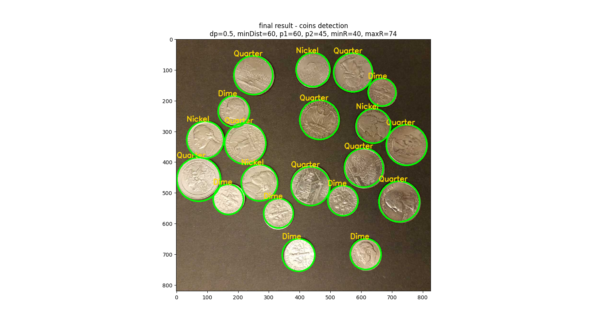 |

---

## 👩‍💻 Author

Created by **Nir David Duani**  
Developed as part of the **Honors Program in Computer Science at Reichman University**,  
focusing on hands-on algorithmic understanding and mathematical modeling in image processing.

