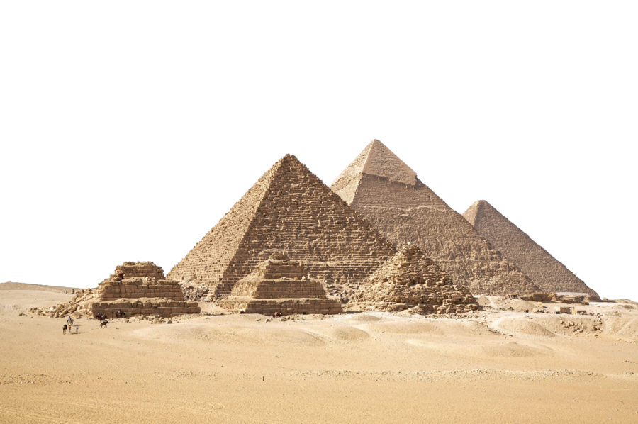
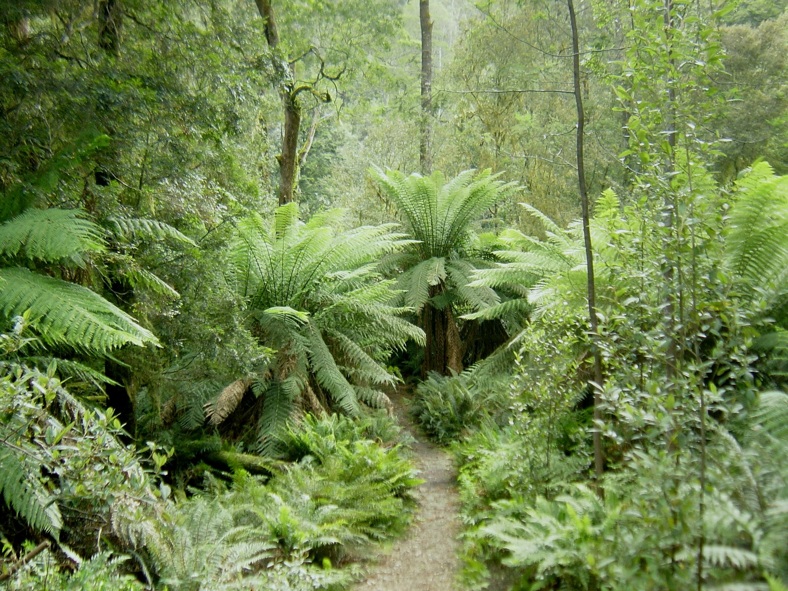
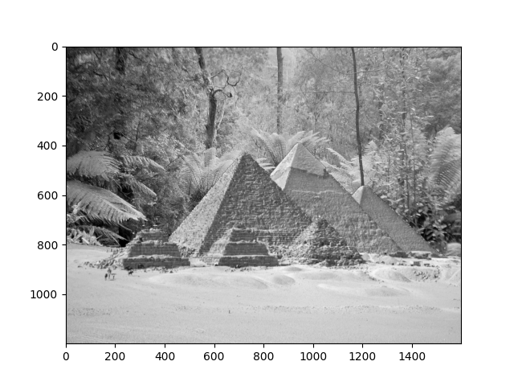

# Assignment 1 — Pyramids Everywhere

This assignment introduces basic **Python**, **NumPy**, **Matplotlib**, and **OpenCV** concepts.  
It includes three exercises that build up from simple text manipulation to image compositing.

## 1. Pyramid Case (Python)
Alternates uppercase and lowercase letters in a string.

**Example:**
**Key Concepts:**  
- Loops and indexing  
- String manipulation and formatting

## 2. Build Pyramid (NumPy & Matplotlib)
Plots pyramid shapes using NumPy arrays and Matplotlib.

| Pyramid Plot Example |
|:--------------------:|
|  |

**Key Concepts:**  
- Array concatenation and reshaping  
- Debugging and visualization

## 3. Forest Pyramid (OpenCV)
Combines two grayscale images — a forest and a pyramid — to create a composite “pyramids in forest” scene.

| Forest | Pyramids | Combined |
|:-------:|:---------:|:--------:|
|  |  |  |

**Key Concepts:**  
- Image masking and overlay  
- Grayscale conversion  
- NumPy logical operations

## Conclusions
- Learned to apply Python basics to visual problems.  
- Practiced array operations in NumPy and plotting with Matplotlib.  
- Gained initial understanding of image manipulation using OpenCV.  
- Saw how mathematical operations on arrays translate directly to image transformations.

## What I Learned
- Writing clean and readable Python code  
- Debugging and visualization using Matplotlib  
- Understanding how arrays represent image data  
- Performing basic image manipulation with OpenCV
