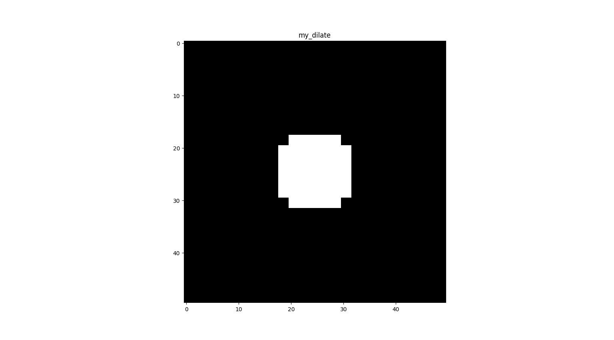
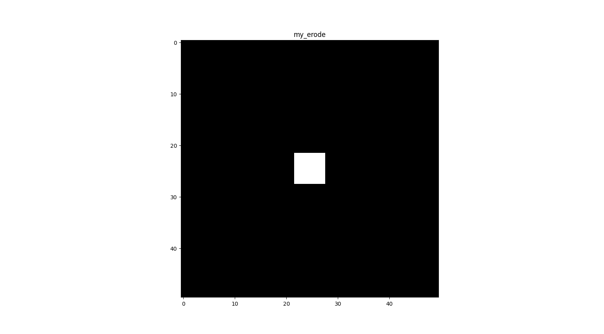
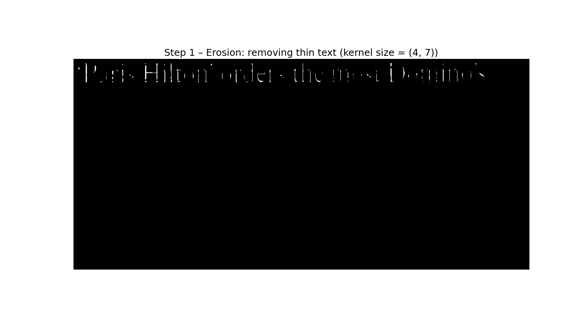
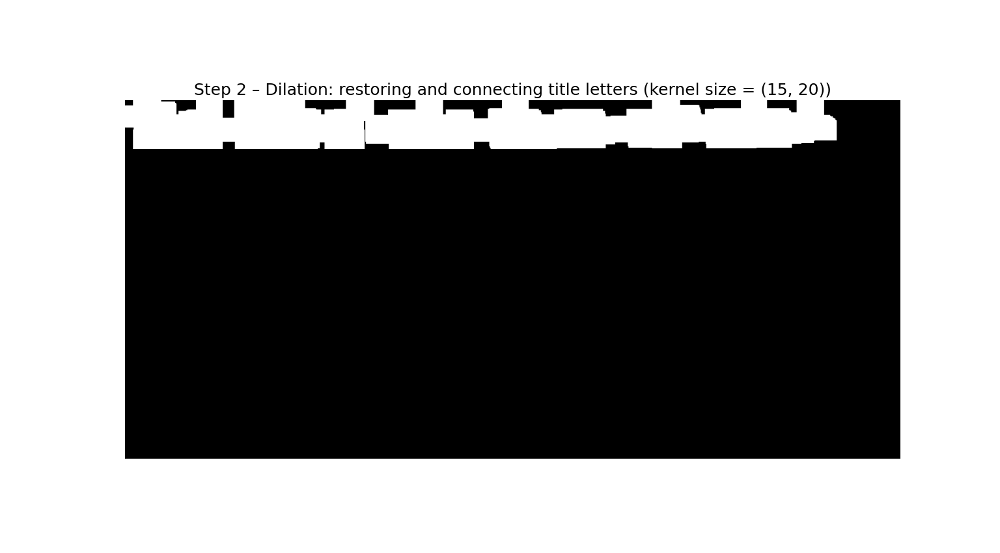

# Assignment 2 — Morphological Operations & Word Detection

This assignment focuses on **morphological image processing** using NumPy and OpenCV.  
It includes two main parts: implementing dilation and erosion from scratch, and detecting words in a newspaper image using morphological operators and connected components.

---

## 🧩 1. Dilation and Erosion (NumPy + OpenCV)

Custom implementations of `dilate` and `erode` were written manually using convolution-like sliding window operations.  
The results were compared with OpenCV’s built-in functions.

**Key Concepts:**
- Binary image manipulation  
- Kernel-based filtering  
- Cross-correlation logic  
- Padding and border handling  

**Examples:**
| Kernel (2×5) | Dilation Result | Erosion Result |
|:-------------:|:----------------:|:---------------:|
| .png) |  |  |

---

## 🗞️ 2. Word Detection in a Newspaper (Morphology + Connected Components)

Using morphological operators to merge characters into words and detect regions of interest.

**Steps:**
1. Convert to grayscale  
2. Apply thresholding  
3. Dilate to merge characters of the same word  
4. Detect connected components and draw rectangles  

**Results:**
| Original Image | Thresholded | Words Detected |
|:---------------:|:-------------:|:---------------:|
|  |  |  |

**Title Extraction (Erosion + Dilation Only):**
| Erosion | Dilation | Final Detected Title |
|:--------:|:---------:|:--------------------:|
|  |  |  |

---

## 🧠 What I Learned
- How morphological operations modify image structure  
- How to implement filters manually with NumPy  
- How connected component labeling works  
- Practical image analysis workflow with OpenCV

---

## 🧰 Tools Used
- Python 3  
- NumPy  
- OpenCV  
- Matplotlib