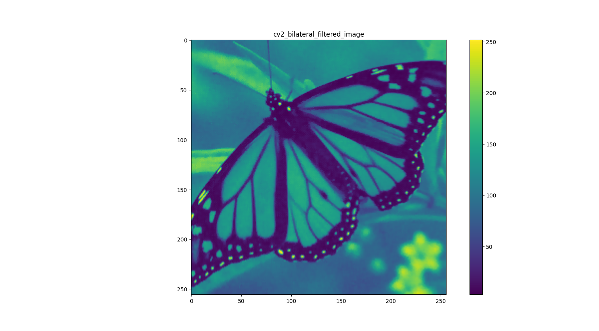
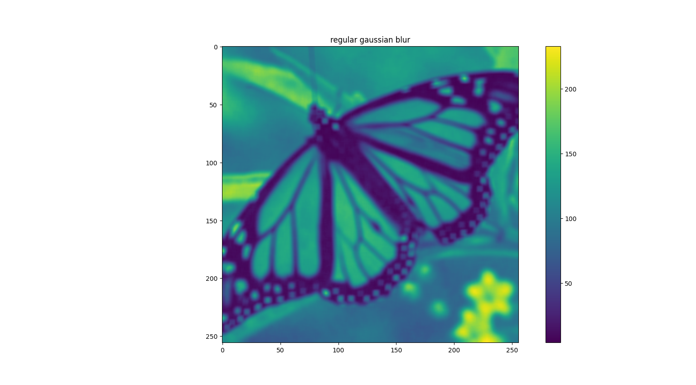
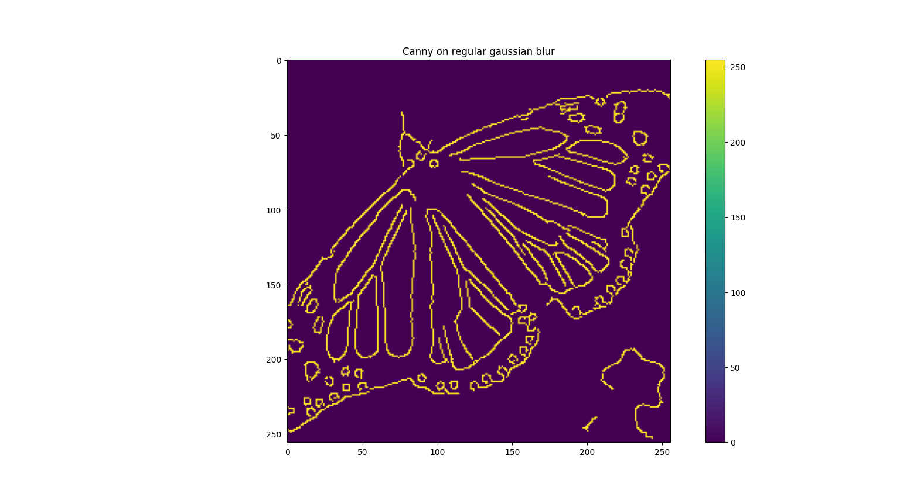

# Assignment 3 - Bilateral Filtering & Edge Detection

This assignment demonstrates the implementation of a **Bilateral Filter** from scratch and compares it to OpenCV’s built-in bilateral filter and a regular Gaussian blur.  
Finally, the results are evaluated using **Canny edge detection** to analyze how each filtering method preserves edges.

---

## 🧩 Bilateral Filter Implementation

A bilateral filter smooths an image while preserving edges by combining two weights:

- **Spatial weight** - proximity of neighboring pixels  
- **Range weight** - similarity in pixel intensity  

**Key Parameters:**
- `d = 5` - filter kernel size  
- `sigma_s = 16` - spatial sigma  
- `sigma_r = 12` - range sigma  

---

## 🧠 Results Comparison

| Original Noisy Image | Custom Bilateral Filter | OpenCV Bilateral Filter | Gaussian Blur |
|:--------------------:|:-----------------------:|:-----------------------:|:--------------:|
|  |  |  |  |

---

## ⚡ Edge Detection (Canny)

| On Custom Bilateral Filter | On Gaussian Blur |
|:---------------------------:|:----------------:|
|  |  |

**Observation:**  
Edges produced after bilateral filtering are cleaner and better preserved, while Gaussian blur tends to smooth them out.

---

## 🧰 Tools Used
- Python 3  
- NumPy  
- OpenCV  
- Matplotlib

---

## 🧠 What I Learned
- How bilateral filtering preserves edges while denoising  
- How OpenCV’s `cv2.bilateralFilter` compares to a custom implementation  
- The impact of different smoothing filters on edge detection
