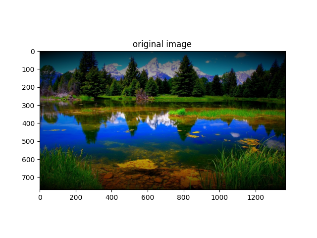
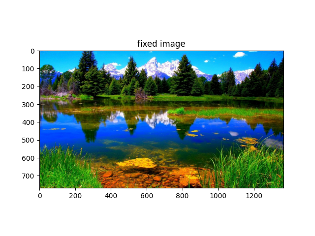
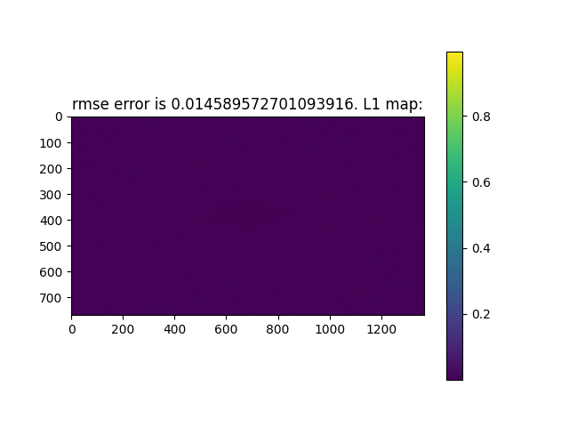
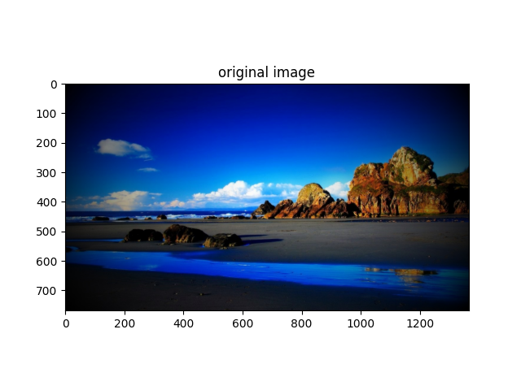
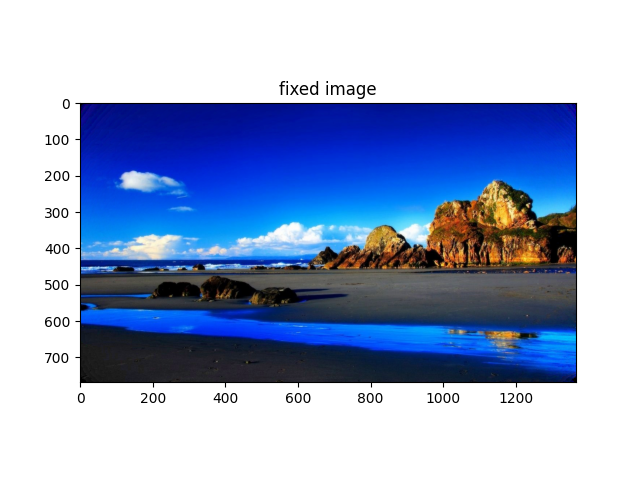

# Assignment 4 — Vignetting Correction

This assignment focuses on detecting and correcting **vignetting**, a common optical issue where brightness decreases toward the edges of an image.  
The goal is to simulate how a camera system can automatically correct for this artifact using a lightweight mathematical model.

## Objective
Develop an algorithm that:
1. Learns the vignetting pattern from a **single calibration image** (white wall).
2. Stores compact calibration parameters (β vector).
3. Uses them to correct any new image taken with the same lens.

---

## Implementation Overview

### Core Functions
- **`get_index_matrix()`** — builds the feature matrix `X` based on pixel coordinates and polynomial terms (`x`, `y`, `x²`, `y²`, `xy`).
- **`get_calib_coeffs(calib_map)`** — computes calibration coefficients using **least squares regression**.
- **`fix_raw_im(b, vig_im)`** — reconstructs the calibration map and applies correction by dividing the raw image by the model’s prediction.
- **`calib_testing()`** — evaluates reconstruction accuracy with RMSE and an L1 error map.

---

## Example Results

| Original | Fixed | RMSE Error Map |
|:---------:|:------:|:---------------:|
|  |  |  |
|  |  |  |
|  |  |  |

---

## Key Concepts
- Vignetting correction via parametric modeling  
- Least squares estimation (`X @ β = y`)  
- Polynomial basis for radial brightness modeling  
- Image normalization and reconstruction using OpenCV and NumPy  

---

## Tools Used
Python 3 • NumPy • OpenCV • Matplotlib

---

## What I Learned
- How to mathematically model optical distortion in images  
- Using least-squares regression for calibration problems  
- How cameras can pre-compute correction maps for different lenses  
- Practical debugging of image correction algorithms and visualization of error maps
