# Assignment 5 — Circle Hough Transform

This assignment focuses on detecting circular shapes using the **Hough Transform**, both through a **manual implementation** of the 3D Hough space and through a **real-world application** using OpenCV’s `cv2.HoughCircles`.  
The goal is to understand how circle detection works mathematically and how it behaves in practical scenarios with noisy, real images.

---

## Objective

Develop two circle-detection systems:

1. **EX5a - Manual Circle Hough Transform**  
   Implement the full pipeline from scratch:
   - Edge detection  
   - Accumulator construction  
   - Radius voting  
   - Thresholding  
   - Minimum-distance filtering  
   - Final circle reconstruction  

2. **EX5b - Coin Detection with HoughCircles**  
   Use OpenCV’s built-in circle detector to locate and classify real U.S. coins based on pixel radius.

---

## How It Works

### 🔵 Manual Hough Transform (EX4b.a)

A circle in an image is defined by:

- **a** - center x coordinate  
- **b** - center y coordinate  
- **r** - radius  

The Hough Transform constructs a 3D parameter space *(a, b, r)* and uses **voting**:

- Each edge point votes for all circles that could pass through it.  
- True circles form strong peaks in the accumulator.  
- After thresholding + minimum-distance filtering → one peak per circle.

This part demonstrates:
- Why the method works even with partial arcs  
- How accumulator resolution influences detection  
- How thresholding and suppression affect final results  

---

# 🎯 EX5a - Manual Circle Hough Transform

## 1. Original Image


---

## 2. Canny Threshold Exploration
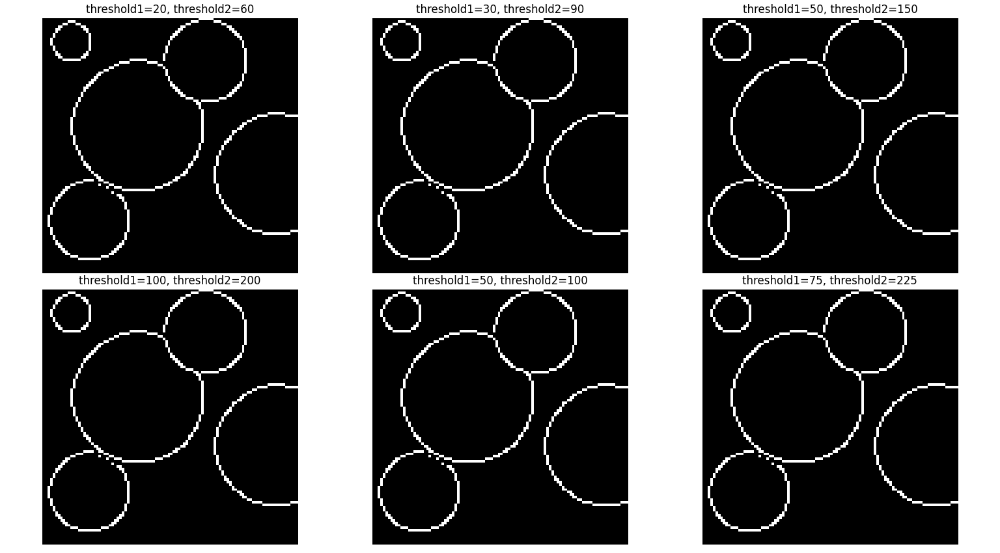

---

## 3. Selected Edge Image
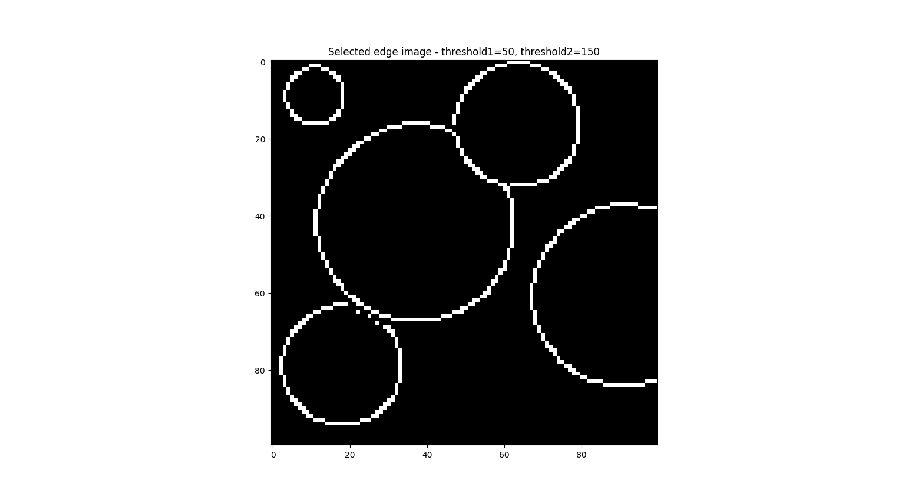

---

## 4. Accumulator (Max Over r)
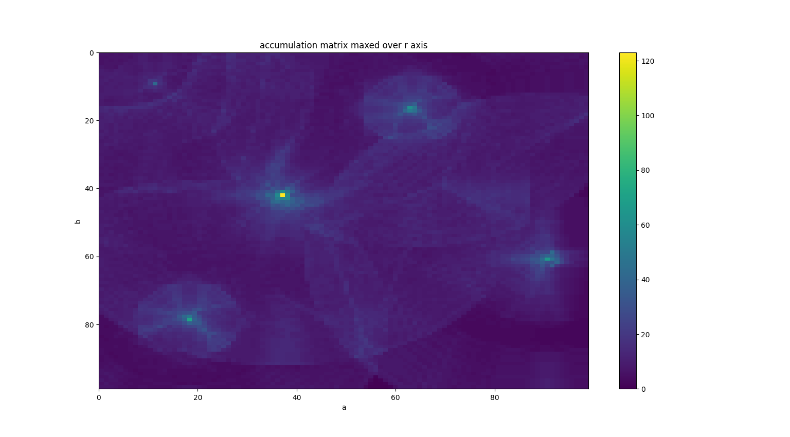

---

## 5. Accumulator After Thresholding
.png)

---

## 6. Accumulator After Threshold + Min-Distance
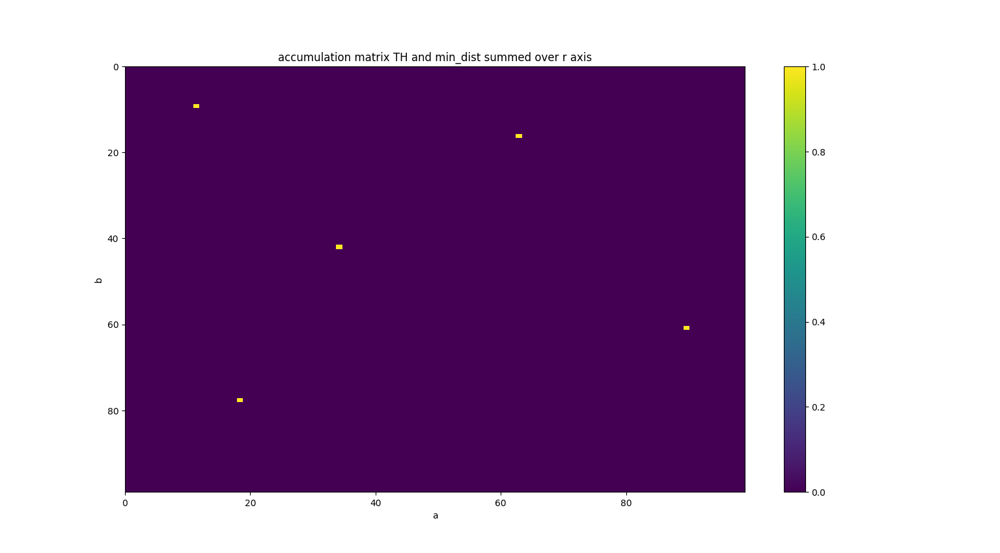

---

## 7. Incorrect Final Result (Before Fixing Bug)
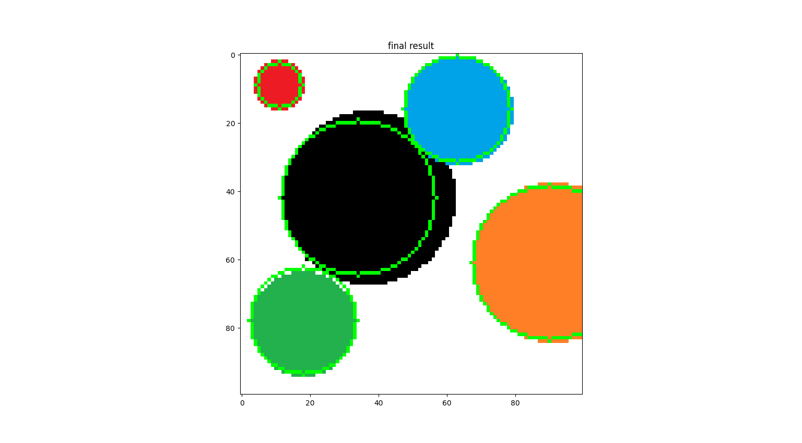

---

## 8. Final Result With Duplicate Circles
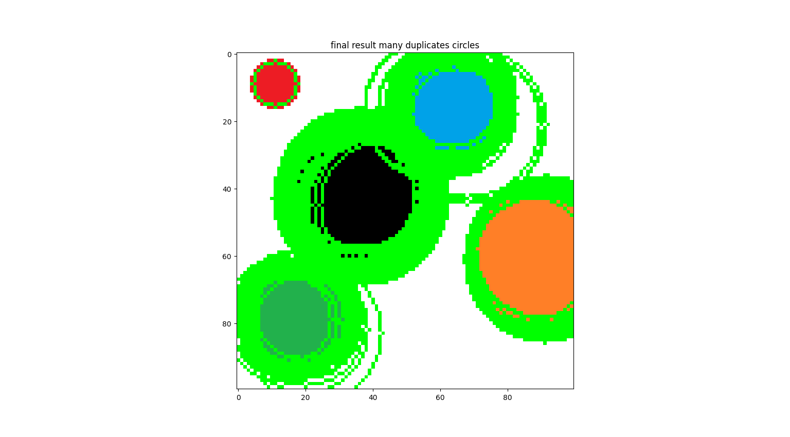

---

## 9. Correct Final Result (Perfect Detection)


---

# 🟢 EX5b - Coin Detection with HoughCircles

The second part applies OpenCV’s built-in circle detector to a real image of U.S. coins.

The image includes:
- High variation in brightness  
- Shadows  
- Coins of multiple sizes  
- Small dimes which are hard to detect  
- Overlapping or partially visible circles  

Parameter tuning was required to stabilize detection.

---

## Failed Attempts (Parameter Testing)

Below are several attempts that **did not detect the coins correctly**.  
These experiments highlight how sensitive `HoughCircles` is to:

- dp (accumulator resolution)
- minDist
- Canny threshold
- accumulator threshold
- radius range

### ❌ Too many false detections
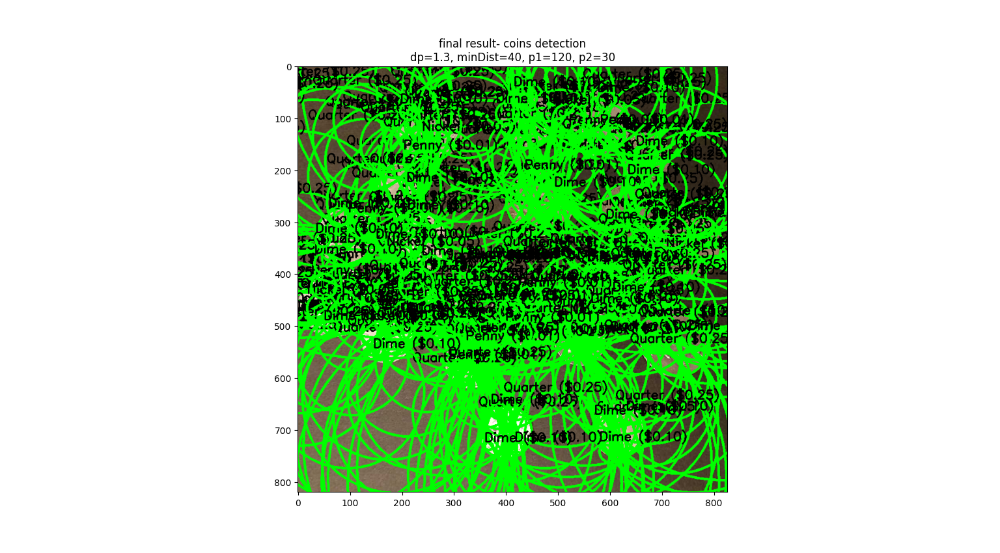

### ❌ Small coins missed
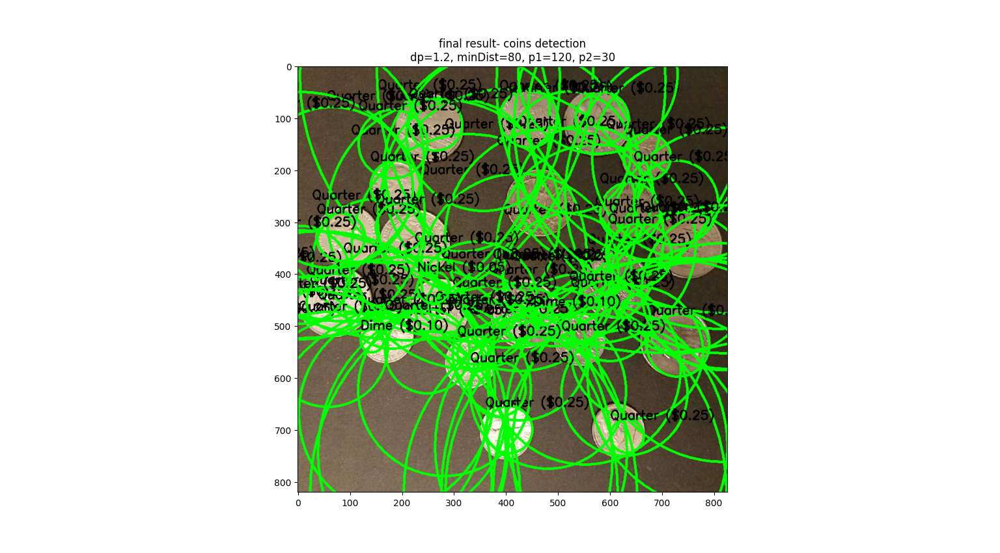

### ❌ Wrong radius range
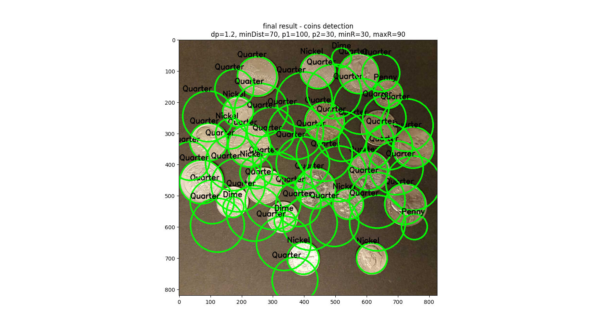

### ❌ Over-detection due to low thresholds
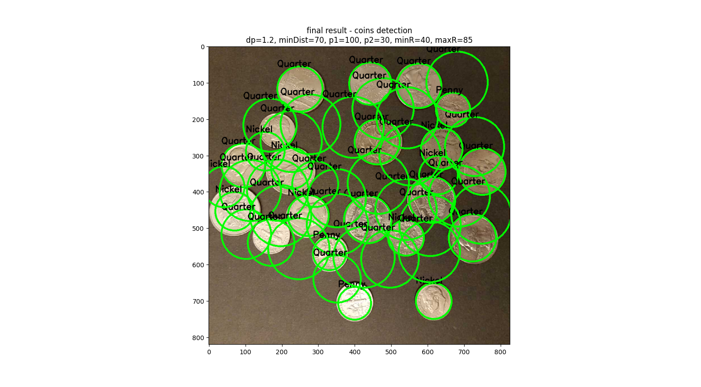

### ❌ Under-detection due to high thresholds


### ❌ dp too small → noisy accumulator


---

## Almost Perfect Detection
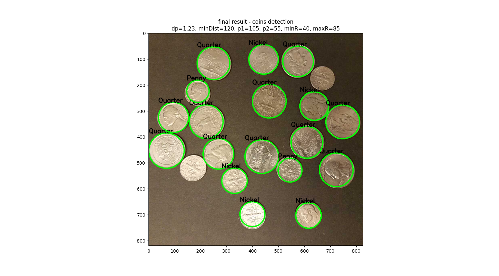

---

## Final Detection - All Coins Correctly Classified


---

## Final Working Parameters

```python
acc_ratio = 1.0
min_dist = 60
canny_upper_th = 60
acc_th = 45
minR = 40
maxR = 74

